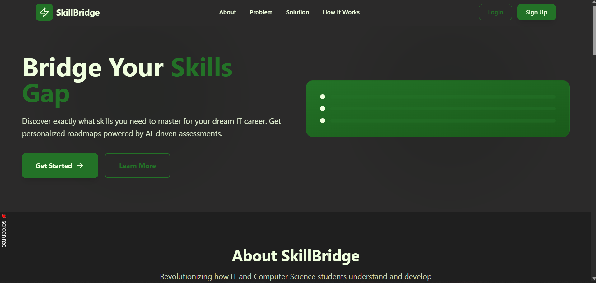
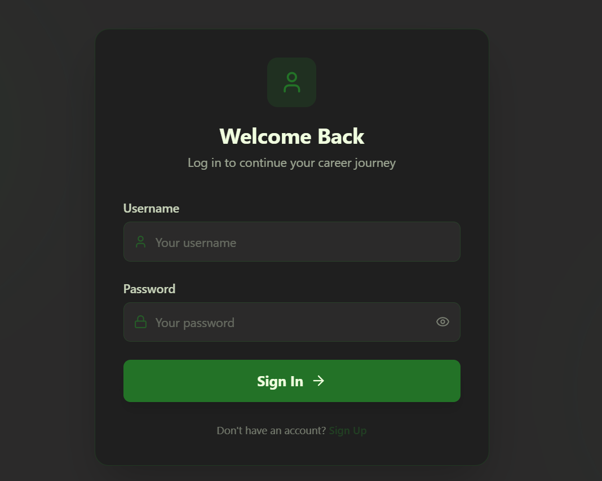
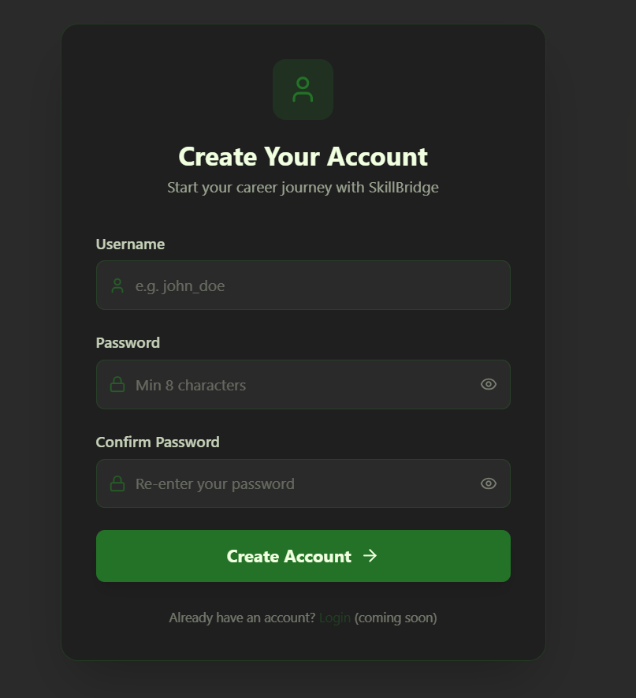
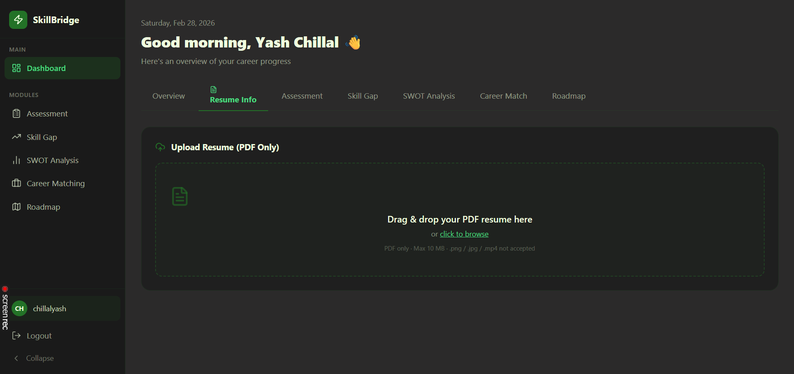
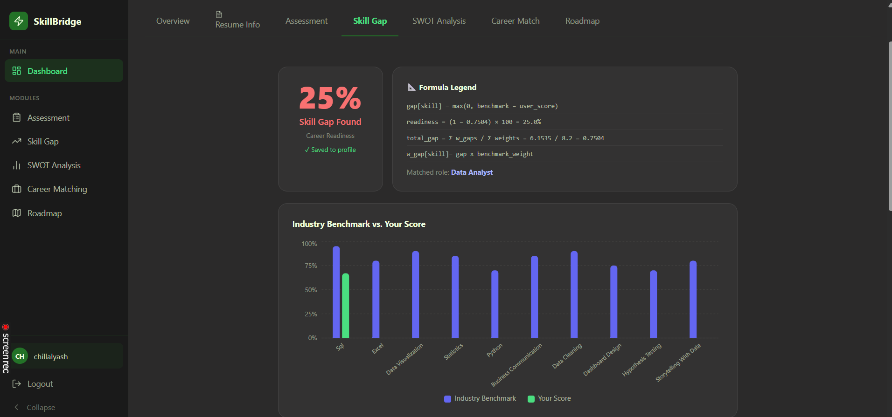
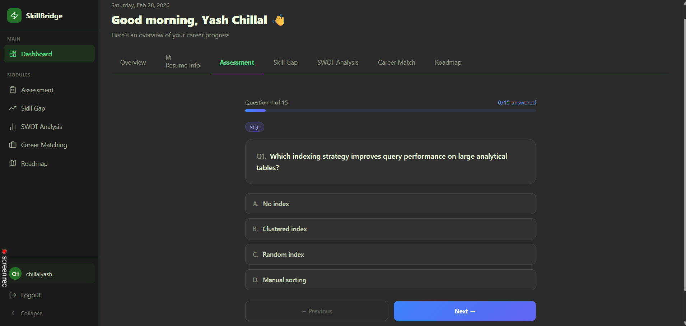
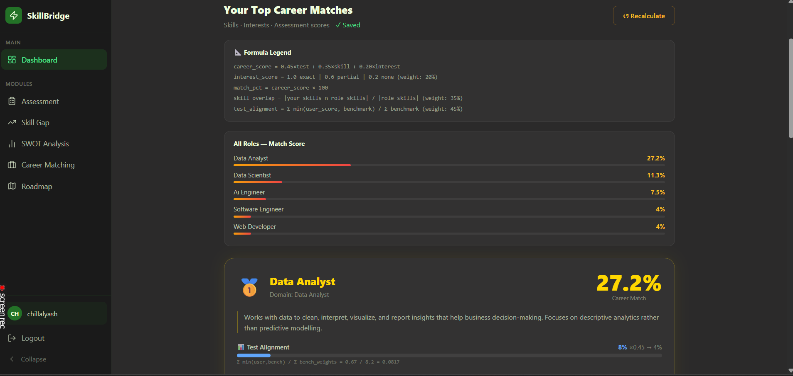
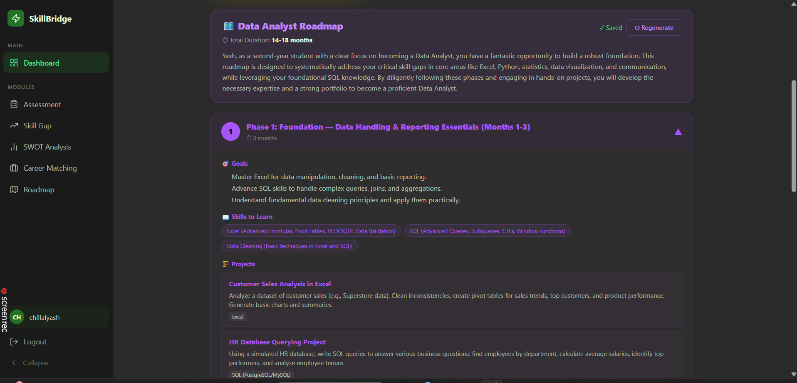

# *Project Morpheous Hackathon 2026*

---

### About

- *SkillBridge* is an AI-Driven Career Guidance & Skill Gap AnalyzerBuilt for the 24-Hour Hackathon.
- *SkillBridge* is an intelligent platform designed to help students navigate the transition from academia to the professional world. By leveraging RAG (Retrieval-Augmented Generation) and LLMs, the platform provides a data-backed audit of a student's current profile against real-world industry benchmarks.

---

### Vision

- Most career tools tell a student what they already are. VARY tells them who they can become. 
- By identifying the "Delta" (the gap) between current skills and industry requirements, we provide an actionable roadmap—not just a summary. 

*Key FeaturesResume Intelligence*:

- Extracts skills, projects, and goals from PDF resumes using high-fidelity parsing (PyMuPDF).

- Semantic Career Matching: Uses a Vector Database (ChromaDB) to find the most compatible career paths based on semantic similarity, not just keywords.

- *Skill Gap Audit*: A granular comparison of user competencies against industry-standard "Gold Benchmarks."Quantified Readiness: Provides a "Job Readiness Score" (Percentage) to give students a measurable goal.

- *Educational Bridge*: Recommends specific, curated courses (Free & Paid) to fill identified gaps.

- ### *Tech Stack Layer Technology* 

1. Frontend: HTML5, Tailwind CSS, 
2. Jinja2 TemplatesBackendFlask (Python)AI / LLMGoogle Gemini API / Ollama (Local Fallback)
3. Vector DBChromaDB (In-memory)
4. Data ParsingPyMuPDF (fitz)
5. VisualsChart.js (Radar & Progress Charts)

### *System ArchitectureIngestion* : Industry standard skills for 50+ roles are vectorized and stored in ChromaDB.

1. *Processing* : User uploads a PDF `->` Text is extracted and normalized by the LLM.
2. *Retrieval* : The system performs a Semantic Search to find the top 3 career matches.
3. *Analysis* : A Python-based scoring engine calculates the gap between user skills and retrieved industry metadata.
4. *Output* : A professional dashboard displaying the Match Score, Skill Gaps, and Course Recommendations.

---

### 1. landing page



---
### 2. login Page


---

### 3. Signup page


---
### 4. Dashboard


---
### 5. Resume upload and parsing


---
### 6. Skill Gap Analysis


---
### 7. Assessment


---
### 8. Career Match


---
### 9. Roadmap


---
### Getting Started

- Prerequisites
1. Python 3.9+
2. Gemini API Key (or Ollama installed for local inference)

- Installation

1. Clone the repository

```
Bash
git clone https://github.com/yashuu05/Project-Morpheous-SkillBrige.git
Project-Morpheous-SkillBrig
```

2. Install dependencies

```
Bash
pip install -r requirements.txt
```

3. Set up Environment Variables

- Create a .env file:
```
Code snippet
GEMINI_API_KEY=your_api_key_here
```

4. Run the application

```
Bash
python app.
```
---

### The Team: SkillBrige

- Ruturaj Bhome (team leader)
- Yash Chillal 
- Akhilesh Dhumal
- Vedant kumbhar

---